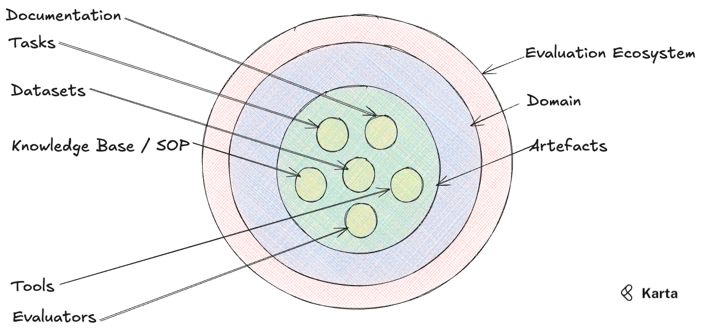

## What this package contains

***Karta Open Evaluations*** is an effort to provide high fidelity, well documented and diverse test cases for AI agents from multiple domains. Building *reliable* agents is hard work. This is an attempt to take the load off developers looking for stable test cases and tools, so that they can focus on fine tuning their agents.

The **evaluation ecosystem** is what this package provides developers access to. A readymade set of capabilities which allows users to focus on the agent rather on dealing with peripheral issues such as setting up tools and sample databases.

Evaluation data sets are split into multiple domains and each domain comes equipped with a set of artefacts that are *self-contained* (needing **no** external data or other user inputs).

A **domain** refers to a broad industry use case such as e-commerce, fintech .etc. Vocabulary, customer requirements, regulations and other subtleties are expected to vary across domains.

Each domain is equipped with a set of **artefacts** that developers can integrate directly into their code. Currently we provide 6 artefacts per domain:

1. **Datasets**: A simulated database containing artificial data relevant to the domain. Each database comes with multiple "tables".
2. **Tools**: A tool factory that creates and vends the tools (along with relevant documentation) required for agents.
3. **Knowledge Base/ SOP:** Ingestable documents containing detailed knowledge and operating procedures specific to a domain.
4. **Tasks:** Handpicked tasks along with expected behavior patterns and classifications into different difficulty levels.
5. **Evaluators:** A unified evaluation interface that allows agent-user interaction trajectories to be evaluated in a few lines of code.
6. **Documentation:** Detailed documentation for each dataset, tool and task.
