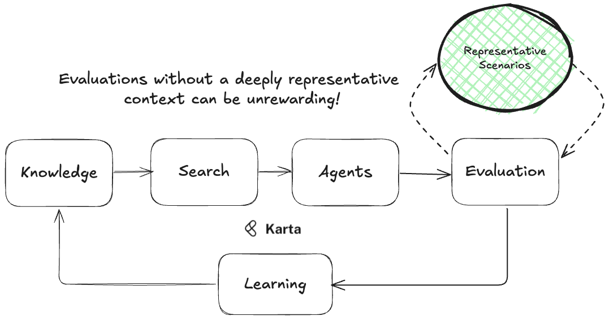

.. KartaEvaluationBenchmarks documentation master file, created by
   sphinx-quickstart on Tue Feb 25 14:43:59 2025.
   You can adapt this file completely to your liking, but it should at least
   contain the root `toctree` directive.

Welcome to Karta Open Evaluations!
-----------------------------------------------------

`Karta Open Evaluations` is designed to provide a comprehensive suite of data, tools and knowledge documents
for testing AI agents across diverse scenarios. It includes structured datasets, predefined test cases, 
tailored for benchmarking agent performance in real-world domains. 
The package allows seamless integration with existing code bases, enabling automated testing workflows and simulations. 

Understand the Basics
^^^^^^^^^^^^^^^^^^^^^
.. toctree::
   :maxdepth: 2
   :caption: Basics:

   howthisworks
   tasks
   howtousethispackage

   

Domain Data
^^^^^^^^^^^
.. toctree::
   :maxdepth: 2
   :caption: Domains:

   ecommerce

Indices and tables
^^^^^^^^^^^^^^^^^^

* :ref:`genindex`
* :ref:`modindex`
* :ref:`search`
