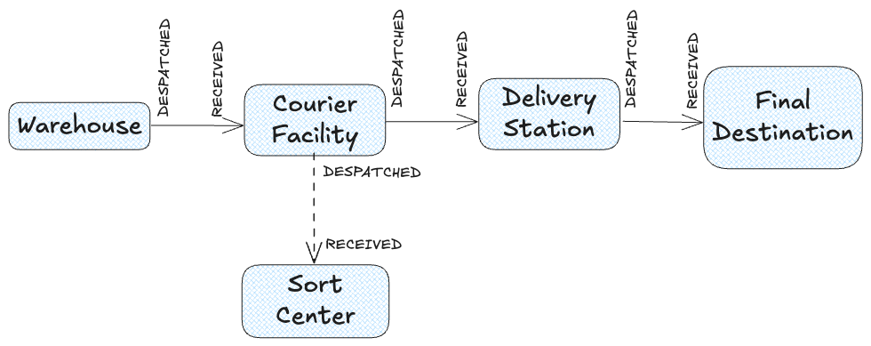

## Be aware of the Time

* Ensure that you know what the current date and time are. You will need to know them accurately so that time senstive queries and time dependent queries can be handled. Use a watch, the clock or a tool to check the current time.

## Approaching a Customer Conversation

* Remember that not all customers will have an order_id or a return_id handy, so if you ask customers for an order id and they donot have it. you have to check the active_orders (in the case of orders) and active_returns (in the case of returns) lists in the customer details. If there are multiple orders and multiple returns, then investigate each one of them till the correct customer order is found. Customers will generally not order ids handy so donot bother them for it again if they have said that they donot have it the first time. The same goes for return_id. It is your responsibility as an agent to figure these details out from the information that the customer has given you.

## Package Movement Stages

### Overview

A package moves through several key stages from its origin to its final destination. Each stage is logged in the tracking system using structured **tracking details** , which include timestamped events, location codes, and location types. Understanding these stages helps ensure seamless package tracking and efficient issue resolution.

### **Stages of Package Movement**

### **1. At Warehouse (WAREHOUSE)**

* The package is stored in the warehouse after being processed for shipment.
* This is the first stage in the shipping cycle where the package is packed, labeled, and prepared for dispatch.
* A **DESPATCHED** event is logged when the package leaves the warehouse.

### **2. At Courier Facility (COURIER FACILITY)**

* The package is received by a courier facility that handles transportation to sorting centers or local hubs.
* A **RECEIVED** event is recorded upon arrival.
* The package may be consolidated with others before moving to the next step.

### **3. At Sort Center (SORT CENTER)**

* The package reaches a regional or national sorting hub where it is organized based on its final delivery location.
* This is a critical transit point where packages are rerouted for efficient distribution.
* A **DESPATCHED** event occurs when the package moves to the next transit location.

### **4. At Delivery Station (DELIVERY STATION)**

* The package is now at the final local distribution center near the recipient.
* A **RECEIVED** event is logged.
* The package is prepared for last-mile delivery, where a delivery agent is assigned.

### **5. Final Destination (FINAL DESTINATION)**

* The package is delivered to the recipient’s address.
* A **RECEIVED** event is recorded, marking successful completion of the shipping process.
* If the package is  **not successfully delivered** , a **DELIVERY FAILURE** event is logged, indicating that the package could not be delivered due to reasons such as:
  * Incorrect address
  * Customer unavailable
  * Security restrictions
  * Damage during transit

## **Tracking System and Event Logging**

Each stage of the package’s journey is recorded in  **tracking_details** , which captures:

* **Event Type** : Whether the package was **DESPATCHED** or  **RECEIVED** .
* **Location Type** : The type of facility where the event occurred ( **WAREHOUSE, COURIER FACILITY, SORT CENTER, DELIVERY STATION, FINAL DESTINATION** ).
* **Location Code**  *(Optional)* : A unique identifier for the facility handling the package.

All the information contained in the event logs is condensed into the current state of the package. This can be one of the following:

* **AT_WAREHOUSE:** This is the origin of every package. Each package begins its journey from a warehouse.
* **IN_TRANSIT**: Typically the middle leg from the warehouse to the delivery station is considered as IN_TRANSIT.
* **AT_DELIVERY_STATION**: This is the final location before the package reaches the customer. Think of it as the last hub.
* **DELIVERED:** The package has been delivered to the customer.
* **DELIVERY_FAILURE**: The package has failed delivery.
* **OUT_FOR_DELIVERY**: The package is out for delivery.
* **RETURN_PICKEDUP**: The package is being returned by the customer and has been picked up.
* **RETURN_COMPLETED:** The return has been completed.

## Returns

Just as packages move on a forward leg to the customer, they can also be returned by the customer. These are called RETURN packages (`type=RETURN`). They follow a slightly different route back to the warehouse. Packages are still RECEIVED and DESPATCHED but in the opposite direction. When the package has been picked up and is in transit to the delivery station its status marked as RETURN_PICKEDUP. When it finally reaches the warehouse its status become RETURN_COMPLETED. Make sure you note the package type and interpret the details accordingly. Return packages are very different from order delivery packages. They are assigned to to an return instead of an order.

## Other General Rules

#### Change to Customer Information

Customer email and customer phone number cannot be updated. The customer will have to create a new account in case the email needs to be changed.

#### Fraudulent Customers

Potentially fraudulent customers are tagged in the customer dataset where the `is_fraud_flag` is set to `true` such customers have to be handled carefully. Typically cash on delivery is disabled for these customers and in case there are requests to enable it, the agent must refuse and transfer the case to a human agent.
