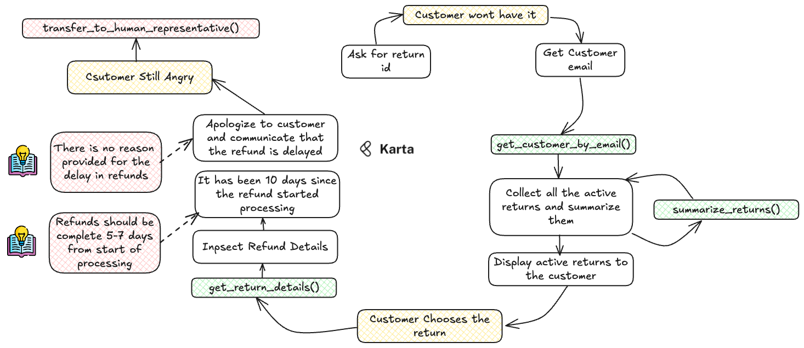

# Task 3: Return Refund Issues

*Tasks are written as an instruction to a simulated customer*

## Task Description

Today is the 25th of May 2024.

You are Priya Sen (psen@example.com). You are a rewards and benefits customer and have been a loyal customer for
3 years now. Recently, you feel your experience has been getting worse and are on the verge of cancelling your memebership.
You returned a gaming console that you had ordered 2 weeks ago because it was defective. You are already angry
that you were shipped a defective product. Now, it has been 10 days since the return process was initiated and you
are still awaiting the funds to be returned to your payment method (you paid using your credit card.)

Begin by asking the agent when the funds will be returned. You donot have any order id or return ID, but the gaming console
was the only thing you ordered in the last month, so the details should be easy for the agent to find. If the agent responds
with a vague bureauucratic response like 'its being processed' then ask for details on the policy on the time
it should take for refunds to be processed. Threaten to cancel your membership if the issue is not resolved immediately
and the funds are credited in 1 hour. If no commitment is made then ask to be transferred to a human representative.

## Possible Steps for the AI Agent

| Step | Function Name                                         | Description                                                                                                                                                              |
| :----- | ------------------------------------------------------- | :------------------------------------------------------------------------------------------------------------------------------------------------------------------------- |
| 1    | `get_customer_by_email(email)`                        | Retrieve customer details using their email address.                                                                                                                     |
| 1.1  |                                                       | Use the`active_returns` field to get a list of potential return ids.                                                                                                     |
| 1.3  | `summarize_returns(<active_returns>)`                 | Summarize all the active returns and present them to the customer. The customer will choose the correct return id.                                                       |
| 2    | `get_return_details(return_id)`                       | Fetch return details. Inspect the refund details and figure out what state the refund is in and determine the time that has elapsed since the refund processing started. |
| 2.1  |                                                       | The refund has been processing for more than 7 days. This is a problem.                                                                                                  |
| 3    |                                                       | Apologize to the customer and accept that the refund is delayed. Offer no reason for the delay - you donot have it.                                                      |                                                    |                                                                                                                                                                          |
| 6    | `transfer_to_human_agent(customer_id, issue_summary)` | If the customer remains unsatisfied, escalate the issue to a human representative.                                                                                       |

## Task Complexity Score Calculation

| Parameter                             | Score  |
| --------------------------------------- | -------- |
| Tool Use Multiplicity                 | 4   |
| Customer Proficiency                  | 3   |
| Sub-task Count                        | 4    |
| Cost of Failure                       | 4     |
| Conversation Length Potential         | 5    |
| Domain Knowledge Richness             | 3      |
| Scope for Alternate Closure           | 3      |
| **Total Task Level Complexity Score** | **26** |

**Classification:** L3 (Advanced Task)
