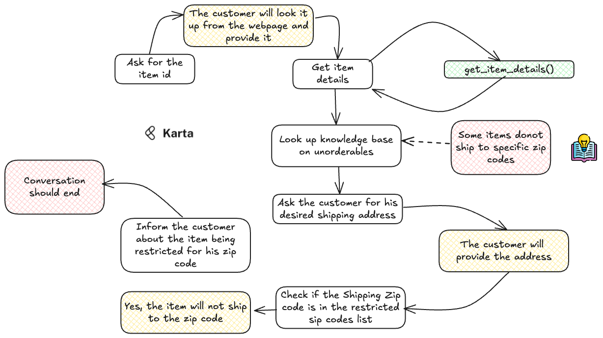

# Task 4: Unorderable Items

*Tasks are written as an instruction to a simulated customer*

## Task Description

Today is the 25th of May 2024.

You are Ahmed Salman (ahmed@example.com). You have been trying to order a Voltas Air Conditioner for your home.
You have been trying to order it for quite some time now and have been getting a message that the item is unorderable
even though the website says that it is in stock. You are getting frustrated and want to know why you cannot order it.

Tell the AI agent your problem. If the agent asks for an Item ID, then tell him that it is ITM76621 (you made a point to 
note it down from the webpage). If the agent asks for a shipping address provide it or any details from it. Your shipping 
address is 400, Church Street, Apt 67, Pin/zip code: 67781.

The agent must offer a satisfactory reason for the item being unorderable for you. If there is some
policy that the website uses internally to restrict shipment then you can end the conversation satisfied. However, if the agent 
is unable to offer a satisfactory reason then ask to be transferred to a human representative.

## Possible Steps for the AI Agent

| Step | Function Name                                         | Description                                                                                                                                                              |
| :----- | ------------------------------------------------------- | :------------------------------------------------------------------------------------------------------------------------------------------------------------------------- |
| 1    |                         | Get the item number from the customer. He/she should be able to look it up on the webpage.                                                                                                                   |
| 1.1  |   `get_item_details(item_id)`                                                    | Get the item details and confirm with the customer that this is the correct item.                                                                                                    |
| 1.2  |                 | Look up the knowledge base for unorderable items and retrieve possible policies. Identify that one of the reasons could be that the customer is trying to ship to a restricted zip code.                                                       |
| 1.3    |                        | Ask the customer for the shipping address or a zip code and check whether the zip code is in the `restricted_zip_codes` list in the item details. If it is, then inform the customer that the item is unorderable for that zip code.  |

## Task Complexity Score Calculation

| Parameter                             | Score  |
| --------------------------------------- | -------- |
| Tool Use Multiplicity                 | 1   |
| Customer Proficiency                  | 3   |
| Sub-task Count                        | 1    |
| Cost of Failure                       | 1     |
| Conversation Length Potential         | 2    |
| Domain Knowledge Richness             | 2      |
| Scope for Alternate Closure           | 2      |
| **Total Task Level Complexity Score** | **12** |

**Classification:** L1 (Basic Task)
